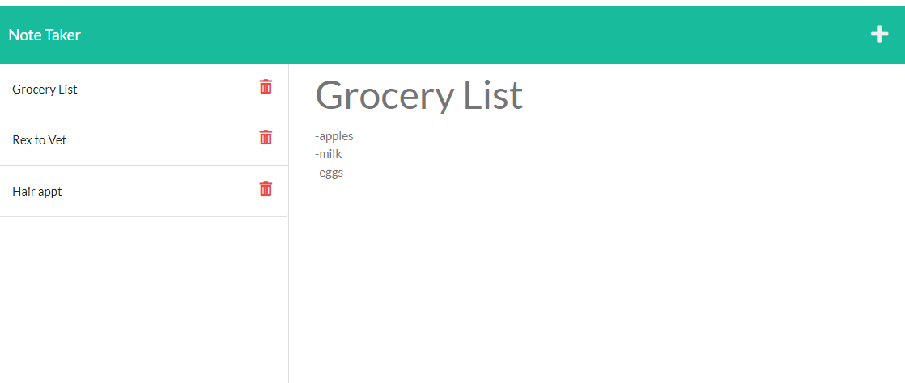

# Note Taker App
  

## Description
The purpose of this application is to write, save and delete notes within the web browser. It uses an ``Express.js`` back end to complete these tasks by manipulating data from a JSON file. This application is completed when fully deployed to Heroku.

## Table of Contents

- [Installation](#installation)
- [License](#license)
- [Contributions](#how-to-contribute)
- [Tests](#tests)
- [Questions](#questions)

## Installation

To install this application, you will need to clone the repo and run a few commands into the terminal.

**Installs include**:

* ``npm init``

* ``npm install express``

* ``npm install uuid`` (This package assigns a random ID to the saved note)

* ``npm install -g nodemon`` (This package will save you some time & sanity when running the application--> make sure you run ``nodemon [your node app]`` in the command line to start the application.)

>_If you want to learn more about any of these npm packages, [click here](https://www.npmjs.com/)._

## License

This project is licensed under **MIT** license.

## How to Contribute

When creating an open source project on GitHub, there is always the option for other developers to contribute to your projects. | If you would like to contribute, please contact me at the email listed below.

## Tests

At this time, no tests have been documented for this application.

## Questions

Please reach out with any questions you may have about this application.

* :octocat: GitHub: [@lindsey-lansford](https://github.com/lindsey-lansford)
* :envelope: Email: lindsey.lansford@gmail.com

## Deployed Heroku Link

To view this web application, [click here](https://cryptic-headland-34027.herokuapp.com/notes)

## Mockup

*Here is an example of the Note Taker application.*